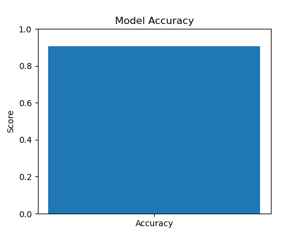
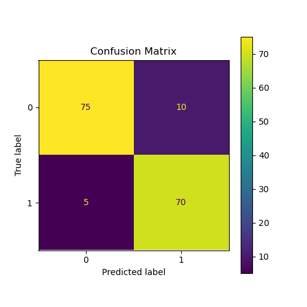

# Diabetes Prediction using Logistic Regression

## Overview

This project demonstrates how Machine Learning can be used to predict whether a person is likely to have diabetes based on various medical attributes. The project uses the **Logistic Regression** algorithm to classify patients as **Diabetic** or **Non-Diabetic**.

The model is trained on a diabetes dataset, evaluated using performance metrics, and then used to predict diabetes status based on user-provided health information.

---

## Features

- Loads the diabetes dataset from a CSV file.
- Performs data preprocessing.
- Splits the dataset into training and testing sets.
- Trains a **Logistic Regression** classification model.
- Evaluates the model using accuracy score.
- Displays a confusion matrix for model evaluation.
- Saves the trained model using Joblib.
- Loads the saved model for future predictions.
- Accepts user input through the terminal.
- Predicts whether a person is diabetic or non-diabetic.

---

## Machine Learning Algorithm

**Algorithm Used:** Logistic Regression

Logistic Regression is a supervised machine learning algorithm used for binary classification problems. It estimates the probability that an input belongs to one of two classes. In this project, it predicts whether a person has diabetes based on several medical measurements.

---

## Dataset

The dataset contains medical information collected from patients.

### Input Features

- Pregnancies
- Glucose
- Blood Pressure
- Skin Thickness
- Insulin
- BMI (Body Mass Index)
- Diabetes Pedigree Function
- Age

### Target Variable

- **Outcome**
  - **0** – Non-Diabetic
  - **1** – Diabetic

---

## Technologies Used

- Python
- NumPy
- Pandas
- Scikit-learn
- Matplotlib
- Joblib
- Anaconda Prompt

---

## Project Workflow

1. Import the required Python libraries.
2. Load the diabetes dataset.
3. Separate the input features and target variable.
4. Split the dataset into training and testing sets.
5. Train the **Logistic Regression** model.
6. Evaluate the model using accuracy score.
7. Generate the confusion matrix.
8. Save the trained model.
9. Load the saved model.
10. Accept medical details from the user.
11. Predict whether the patient is diabetic or non-diabetic.

---

## Project Structure

```text
diabetes_prediction_project/
│
├── diabetes.csv
├── diabetes_model.py
├── predict_diabetes.py
├── diabetes_model.pkl
├── accuracy_graph.png
├── confusion_matrix.png
└── README.md
```

---

## How to Run

### Step 1

Open **Anaconda Prompt**.

### Step 2

Navigate to the project directory.

```bash
cd path_to_project_folder
```

### Step 3

Train the model.

```bash
python diabetes_model.py
```

### Step 4

Run the prediction program.

```bash
python predict_diabetes.py
```

### Step 5

Enter the required medical details when prompted.

Example:

```text
Pregnancies: 2
Glucose: 120
Blood Pressure: 70
Skin Thickness: 20
Insulin: 85
BMI: 28.5
Diabetes Pedigree Function: 0.35
Age: 35
```

Example Output:

```text
Prediction: Non-Diabetic
```

or

```text
Prediction: Diabetic
```

---

## Output Screenshots

### Model Accuracy

The following screenshot shows the accuracy obtained by the Logistic Regression model.



### Confusion Matrix

The confusion matrix below illustrates the model's classification performance by comparing actual and predicted outcomes.



---

## Requirements

This project was developed and executed using **Anaconda Prompt**.

Required Python libraries:

- numpy
- pandas
- scikit-learn
- matplotlib
- joblib

---

## Applications

- Early diabetes risk prediction
- Healthcare decision support systems
- Medical diagnosis assistance
- Clinical data analysis
- Machine learning classification projects
- Educational purposes

---

## Future Improvements

- Train the model using a larger dataset.
- Improve prediction accuracy through feature engineering.
- Compare Logistic Regression with other classification algorithms.
- Develop a graphical user interface (GUI).
- Build a web application for online predictions.
- Integrate real-time patient data for prediction.

---

## Conclusion

This project demonstrates the implementation of the **Logistic Regression** algorithm for diabetes prediction using patient medical data. It follows a complete machine learning workflow, including data preprocessing, model training, evaluation, and prediction. The project serves as a practical example of applying supervised machine learning techniques to solve a real-world healthcare classification problem.
